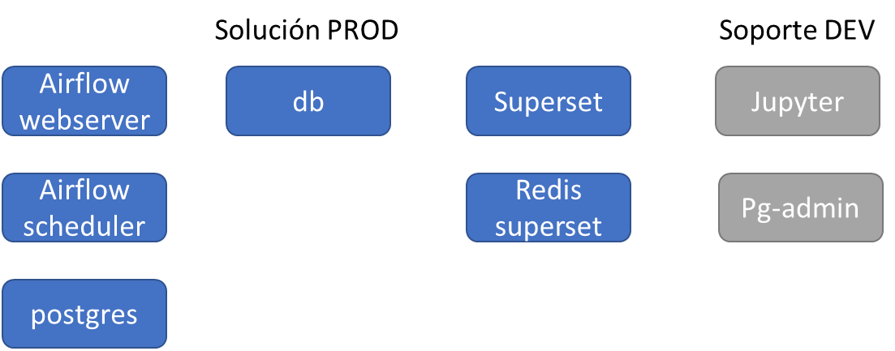
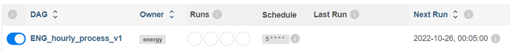
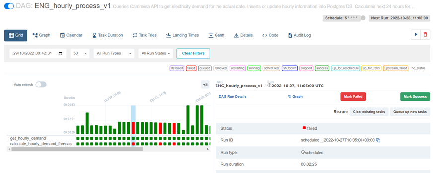
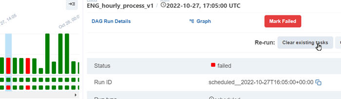
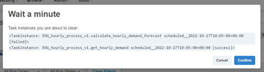

# TP Seminario 2022
Este repo presenta una solución desarrollada en el marco del Seminario 2022 de Tópicos
Avanzados en Datos Complejos, de la Especialización en Ciencia de Datos del ITBA.

Creado por C.Olmo colmo@itba.edu.ar, colmo786@gmail.com

## Objetivo de la Solución
Presentar en forma horaria una proyección de la demanda de energía eléctrica de Argentina para las próximas 24 horas.

## Conceptos de la Implementación de la Solución
La solución tiene como tareas macro:
- Obtener en forma horaria el dato de demanda horaria (y temperatura) de energía eléctrica, a nivel total Argentina. Este dato es publicado por una API implementada por la empresa Cammesa. Registrar este dato en una base de datos donde se mantiene la historia.
- Con los datos obtenidos y un modelo pre fiteado, obtener una predicción para las próximas 24 horas.
- Exponer el histórico y la proyección en un dashboard.

La solución se implementó en una serie de containers, permitiendo portabilidad de la solución y reducir tiempo de configuración de los entornos de ejecución de cada bloque de la solución. Se desarrolló en una máquina Windows 10 con 16 Gb de ram. Para poder ejecutar Docker se instaló WSL y luego Docker. Como IDE se utilizó VS Code.
## Esquema de Containers

Se incluyen tanto los containers necesarios para la solución en ambiente productivo (color azul de fondo) y los que se utilizaron en la etapa de desarrollo (color gris de fondo)

## Instalación
La solución requiere tener instalado docker (Engine: 20.10.17) y Compose: 1.29.2. Mínimo 16 Gb de RAM.
1. Clonar el repo
2. Posicionarse en la carpeta docker: `cd docker`
3. Builtear la imagen de Airflow con el comando `./dockers.sh build_airflow.`
4. Opcional: Builtear la imagen de Jupyterlab con el comando `./dockers.sh build_jupyter` 
NOTA: Esta imagen se utilizó para desarrollo y pruebas del código luego volcado en los DAGs.
5. Inicializar Airflow con el comando `./dockers.sh init_airflow`. Esta serie de comandos actualizan la DB de airflow y crean el usuario admin/admin para acceder a esa aplicación.
6. Si el comando anterior terminó con code 0, ejecutar `./docker.sh start_all`. Demora unos minutos.
En el Docker Desktop deberán quedar 8 containers (de 9) ejecutándose.
7. Acceder a Airflow en http://localhost:8080/home. Usuario: `airflow` Password: `airflow`  
NOTA: dependiendo de los recursos de la máquina, los dockers pueden demorar en terminar de cargarse y en alguna oportunidad se experimentó que Airflow detecta errores en los DAGs (no encuentra la ubicación de tensorflow, o similar) pero con refresh comienza a funcionar.
8. Habilitar el DAG ENG_hourly_process_v1. Tiene como fecha de inicio el día posterior al último dato histórico pre cargado en la base de datos. Ejecutará un backfill (cada hora, a los 5 minutos) hasta la hora en que se habilita el DAG. 

### Troubleshooting
Durante el backfill, ee detectaron casos en los que, por falta de recursos, las tareas de los DAGs terminaron con error.
Para volver a ejecutarlas, seleccionar la barra correspondiente a la ejecución con error y presionar el botón `Clear existing tasks` Esto permitirá que se repita la ejecución. 

## Dashboard Superset
Los resultados se muestran en un Dashboard creado en Superset. http://localhost:8088/login/
Usuario: `admin` Password: `admin` 
 

